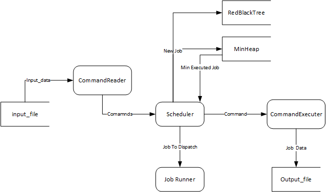
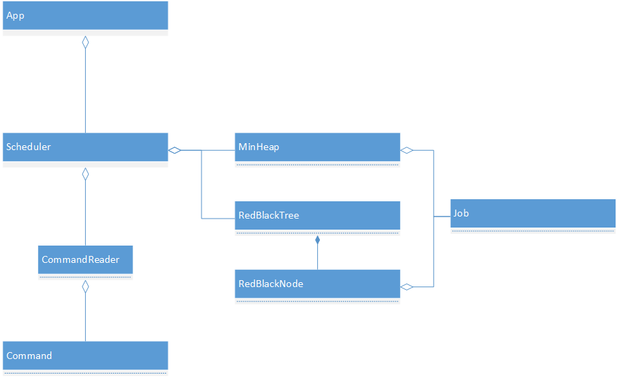

# Advanced Data Structures Report

### Information:

1. Name: 
2. UFID: 
3. EMAIL: 

### Structure:

The program is separated into three components: the scheduler,
command reader, and the backend data structures(Min Heap, Red Black Tree). The command reader reads a command and
holds it until the appropriate time stamp. The scheduler is querying the the command reader each time step to see if
the scheduler can execute the command. Additionally, the scheduler is dispatching a job whenever the processor has
opened up. The scheduler uses the data structures for efficient job dispatching.

Once all commands have been read, the scheduler finishes running jobs and exits.






**RedBlackTree.java**

Contains the implementation of the RedBlackTree.

Supports:

* add
* delete
* search
* next
* prev
* search in range

```java
    // Searching methods
	public Job search(Job newJob);
	public String next(Job newJob);
	public String previous(Job newJob);
	public String searchInRange(int startId, int tailId);

	// Util method for searches
	private String searchInRangeRecursive(RedBlackNode node, int startId, int tailId);
	private RedBlackNode search(RedBlackNode node, int key);

    // Enums for easy switches/compares
	public enum Color { RED, BLACK}
	public enum InsertRotation { NONE, RRr, RRb, LLr, LLb, RLr, RLb, LRr, LRb}
	public enum DeleteRotation { Rb01, Rb02, Rb11, Rb12, Rb2, Rr0, Rr11, Rr12, Rr2,
								 Lb01, Lb02, Lb11, Lb12, Lb2, Lr0, Lr11, Lr12, Lr2}

	public void delete(Job toDelete);
	public void add(Job currentJob);

	// Util methods
	private RedBlackNode findDeficientNode(int degree, RedBlackNode node);
	private int checkDegreeOfDeletion(RedBlackNode next);
	private void performDeleteRotation(RedBlackNode deletedNode, DeleteRotation deleteRotation);
	private RedBlackNode checkForPropertyMaintained(RedBlackNode node);
	private void performRotation(RedBlackNode insertNode, InsertRotation insertRotation);
	private DeleteRotation classifyDeleteRotation(RedBlackNode deleteNode);
	private InsertRotation classifyInsertRotation(RedBlackNode insertNode);
```

**MinHeap.java**

Contains the implementation of the MinHeap

Supports:

* peak
* extract min
* increase key
* print heap

```java
	public MinHeap();
	public Job peak();
	public void add(Job currentJob);
	public Job extractMin();
	public void printHeap();

    // Runs in O(n), would have been better off using a fib heap
	public void increaseKey(Job runningJob, int i);

    // Util methods
	private void doubleHeapArray();
	private void heapify(int parentIndex);
```

**Scheduler.java**

This class contains the implementation of the job scheduler.

The `start()` method starts the scheduler.

Within this method, `checkJobFinished(currentTime)`is called so the job may be removed. Following this, obtaining the next command,
`commandReader.next(currentTime)`, `executeCommand(command)`, and finally `dispatchJob()`


```java
	public Scheduler(CommandReader commandReader, String filename);
	public void write(String toWrite);
	public void start();
	public void stop();
	public String executeCommand(Command command);
	public boolean dispatchJob();
	public void addJobs(Command command);
	public void printJob(Command command);
	public void printNextJob(Command command);
	public void printPreviousJob(Command command);

	public MinHeap getMinHeap();
	public RedBlackTree getRbt();

	private void checkJobFinished(int currentTime);
	private void openWriter(String filename);
```

**Job.java**

This class serves a a structure for the job's data

```java
	public Job(int id, int totalTime);
	public void setTotalTime(int totalTime);
	public int getExecutedTime();
	public int getTotalTime();
	public int getId();
	public String toString();
	public boolean equals(Object obj);
	public void setExecutedTime(int executedTime);
```

The other two classes `Command.java` and `CommandReader.java` take care of file IO and are not very
important to the structure of the program.


Sample input files: 1, 2 and 3 have been tested on the program with correct results and no errors.
All files have been tested on *cise* computers to verify build and execution.

All files have finished in less than 50 milliseconds.

### Difficulties

The difficulty of the program was directly related to the implementation of the RedBlackTree. There are many details
that must be accounted for such as degree of deletion, colors, rotations, and external nodes. I have done my best to account for
all of these details in the implementation.

All search algorithms have been implemented efficiently.

1. **PrintJob**: O(lg(n))

2. **PrintNext**: O(lg(n))

PrintNext does not require the job to be present, it searches on the value. PrintNext keeps track of the last left child transition to find next in exactly one pass of the tree in case no
right external node is present. (Doesn't have to retrace steps)

3. **PrintPrev**: O(lg(n))

PrintPrev does not require the job to be present, it searches on the value. PrintPrev also keeps track of the last right child transition to find the next in exactly one pass of the tree in case no
left external node it present. (Doesn't have to retrace steps)

4. **PrintInRange**: O(lg(n) + S) S is the number of nodes returned

Print in range really has a time complexity of: O(2lg(n) + S), has to search for two different keys.


#### Incrementing Min Heap

The algorithm that increases the key in a min heap runs in O(n) because we can't directly increment the key without
checking for changes in the heap. The runtime could be improved by checking multiple paths for the key, but I have
chosen to go with the simple solution of searching the array linearly as there were no constraints for this.

### Running Instructions

In the directory of the folder run:

```
make
```

then:

```
java jobscheduler input_file
```
